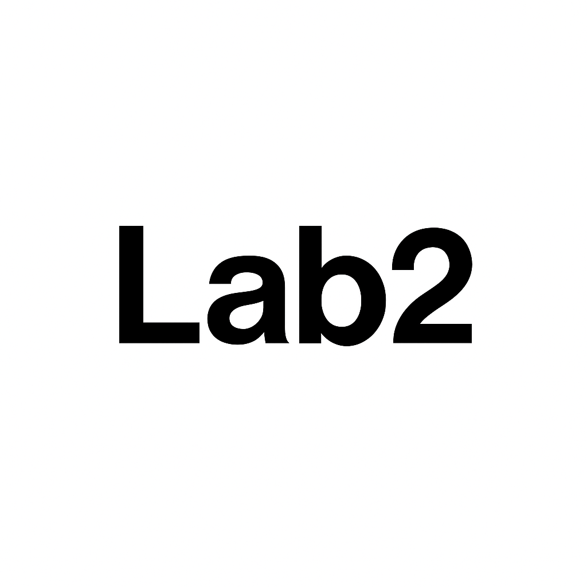

<p align="center">
  
</p>

<p align="center">
  
  
  
</p>

<p align="center">
  <a href="#overview">Overview</a> •
  <a href="#how-to-run">How&nbsp;to&nbsp;Run</a> •
  <a href="#project-structure">Project&nbsp;Structure</a> •
  <a href="#flow">Pipeline&nbsp;Flow</a> •
  <a href="#limitations">Limitations</a> •
  <a href="#future">Future</a> •
  <a href="#authors">Authors</a>
</p>

# Lab 2 — **CRISP-DM** Weather Forecast Pipeline

- Repo này chứa **toàn bộ notebook Lab 2** môn ADY201m (thầy Hùng BK).  
- Pipeline dựa trên CRISP-DM, với dữ liệu từ **Open-Meteo API**.  
- Repo Lab 3 (UI app) **[link tại đây](https://github.com/letrongv4ng/ady201m-group3)**.

## Overview
- 4 notebook: `2.1_business_understanding` tới `2.4_modeling_evaluation`.
- Thu thập dữ liệu dự báo thời tiết 7 ngày từ Open-Meteo.
- Lưu snapshot CSV + sơ đồ reports/figures.
- Tiền xử lý, tạo đặc trưng, baseline model.
- Evaluation: heuristic vs logistic regression (Acc, F1, Confusion Matrix).

## How to run
```bash
git clone https://github.com/letrongv4ng/ady201m-lab2
cd ady201m-lab2

# create env if needed
pip install -r requirements.txt

# open notebooks
jupyter lab
# hoặc VSCode Jupyter extensionn
```

## Project Structure
```
.
├── notebooks/
│   ├── 2.1_business_understanding.ipynb
│   ├── 2.2_requirements_collection.ipynb
│   ├── 2.3_understanding_preparation.ipynb
│   └── 2.4_modeling_evaluation.ipynb
├── data/
│   ├── raw/          # snapshot raw CSV
│   ├── interim/      # validated
│   ├── processed/    # clean + features
│   └── reports/      # figures, metrics
├── assets/
│   └── lab2.png
├── requirements.txt
└── README.md
```

## Flow

1. Business understanding
  - Đặt câu hỏi nghiệp vụ → “dự báo mưa/nắng ngắn hạn”.

2. Requirements & Collection
  - Fetch API → lưu raw snapshot.

3. Understanding & Preparation
  - Schema check, clean, clip extreme, tạo features (temp_range, rain_flag, dow).

4. Modeling & Evaluation
  - Heuristic baseline vs Logistic Regression, metric: Acc, F1, CM.

## Limitations

- Dataset demo 7 ngày nhỏ, không cross-val / significance test.

- Chưa có feature engineering phức tạp.

- Confusion matrix và report cơ bản, chưa visualize đẹp.

## Future

- Reuse pipeline trong repo Lab 3 (Streamlit app).

- Bổ sung feature engineering nâng cao.

- Lưu run manifest/hash để trace (cho Lab 3).

## Authors

- Lê Quang Hưng – Leader, code pipeline, modeling.

- Đinh Quang Minh – Data prep, visualization.

- Đỗ Mạnh Chung – API integration, repo setup.
